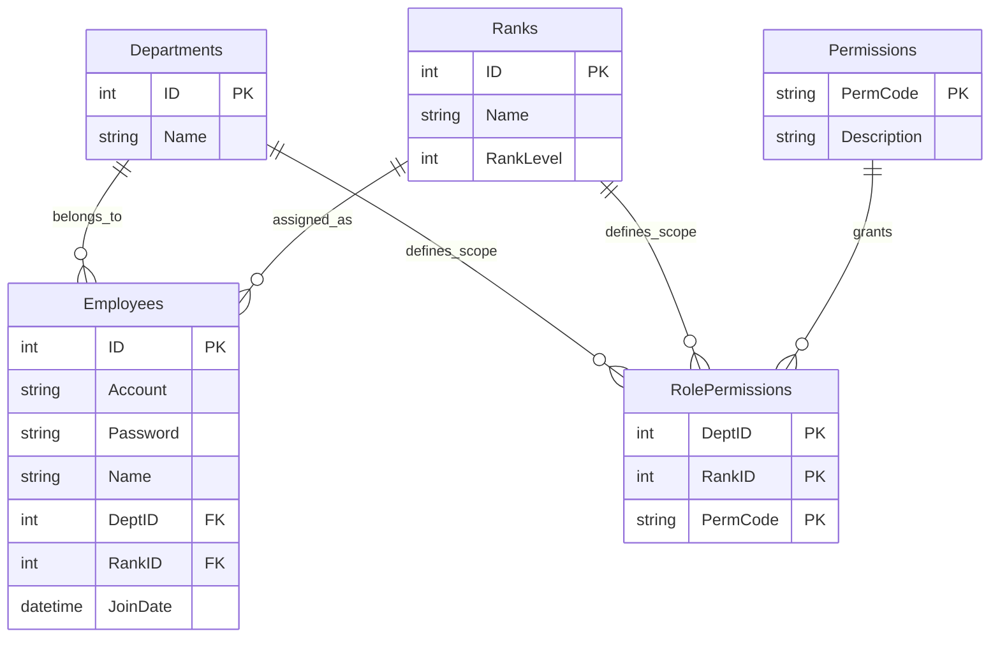

# HrmsDemo - 企業級 WinForms 權限管理系統範例

這是一個展示如何在傳統 **WinForms** 應用程式中，實現現代化架構、高效能數據處理與彈性權限設計 (RBAC) 的技術示範專案。適合開發者參考如何構建可維護的企業級桌面應用程式。

## 專案亮點 (Key Features)

### 1. 高效能數據呈現 (High Performance UI)
不依賴分頁控制項，直接實作 **DataGridView Virtual Mode (虛擬模式)**。
- **毫秒級載入**: 僅渲染視窗可見範圍內的數據，即使資料庫有數萬筆員工資料，介面依然流暢不卡頓。
- **動態捲動**: 模擬無限捲動 (Infinite Scroll) 的使用者體驗。

### 2. 精細的權限控制系統 (Flexible RBAC)
捨棄單純的「管理員/使用者」二分法，採用 **由下而上 (Bottom-up)** 的權限設計模式：
- **矩陣式角色**: 角色由 `部門 (Department)` + `職級 (Rank)` 交叉組合而成 (例如：人事部-經理、行政部-職員)。
- **資料範圍權限**: 支援細粒度的資料存取範圍控制：
  - `VIEW_SELF`: 僅查看自己
  - `VIEW_DEPT`: 僅查看同部門
  - `VIEW_ALL`: 查看全公司
- **功能級權限**: 針對特定按鈕或操作 (新增、修改、刪除) 進行授權。

### 3. 清晰的分層架構 (Clean Architecture)
展示如何在 WinForms 專案中維持程式碼的整潔與可測試性：
- **Repository Pattern**: 將資料存取邏輯封裝，與 UI 解耦。
- **Service Layer**: 集中處理商業邏輯與權限驗證。
- **Thin UI**: Form 只負責顯示與事件轉發，不包含複雜邏輯。

---

## 技術核心 (Tech Stack)

*   **Runtime**: .NET 10.0 (Windows) - 運用最新的 .NET 效能優勢。
*   **ORM**: [Dapper](https://github.com/DapperLib/Dapper) - 輕量級、高效能的微型 ORM，保留 SQL 的彈性與全速運作。
*   **Database**: MySQL 8.0+ - 穩定可靠的開源資料庫。
*   **Design Pattern**: Repository Pattern, Singleton (DbHelper), Async/Await。

---

## 快速展示 (Quick Demo)

本專案內建預設的測試情境，方便快速體驗不同角色的權限差異：

1. **超級管理者 (人事-主管)**: 登入 `hr_manager` / `1234`
   - *體驗*: 可以看到所有按鈕，能編輯任何人，能管理部門與職位。
2. **部門管理者 (行政-主管)**: 登入 `admin_manager` / `1234`
   - *體驗*: 只能看到自己部門的員工，且無法點擊「系統設定」相關按鈕。
3. **一般員工 (行政-職員)**: 登入 `admin_staff` / `1234`
   - *體驗*: 登入後列表只有自己一筆資料，無法進行任何編輯操作。

## 資料庫架構 (Database Schema)

## 初始 Prompt

-工具：Visual Studio 2026
-框架：.NET 10.0, winforms
-語言：C#
-資料庫：MySQL(Ver 8.0)
-專案名稱：人事管理系統 demo
-專案功能：
** 1. 員工資料管理(ID, name, account, password, gender, rankID, deptID, birthday, createDate, joinDate, leaveDate, isEmployed, mobile, email, note)
** 2. 部門資料管理(ID, name)
** 3. 職位資料管理(ID, name, rankLevel)
** 4. 權限資料管理(permCode, description)
** 5. 角色權限管理(角色由部門與職位排列組合而成：deptID, rankID, permission)
** 6. 登入畫面：開啟應用程式後出現登入畫面，登入後進入主畫面，登出後返回登入畫面，登入畫面輸入框保留上一個登入者的account
** 7. 主畫面左半邊：員工資料概覽列表(dataGridView1)，具有搜尋功能，點擊某一行可以在主畫面右半邊查看該行員工的詳細信息，進入主畫面時根據登入者權限可檢視的員工不同，默認置頂行與選取登入者資料
** 8. 主畫面右半邊：員工資料詳細信息(textBox：帳號(ReadOnly)、密碼、姓名、行動電話、電子信箱、備註，comboBox(自資料庫中載入key-value)：性別、職級、部門，dateTimePicker：生日、加入日期、離職日期，checkBox：是否離職)，由左半邊列表點擊某一行顯示，默認顯示登入者資料，下方有功能按鈕(新增、修改、刪除、取消)
** 9. 主畫面上方：toolStripMenuItem1 中含有開啟部門資料管理、職位資料管理、權限資料管理、角色權限管理、登出
** 10. 權限種類：ADD_USER:新增員工, 
                DELETE_USER:刪除員工, 
                EDIT_USER:修改員工, 
                SET_RESIGNED:設為離職, 
                VIEW_ALL:查看所有員工資料, 
                VIEW_SELF:只能查看自己的資料, 
                VIEW_DEPT:只能查看自己的部門員工資料, 
                WRITE_NOTE:修改與檢視員工備註, 
                ADD_DEPT:新增部門, 
                DELETE_DEPT:刪除部門, 
                EDIT_DEPT:修改部門, 
                ADD_RANK:新增職位, 
                DELETE_RANK:刪除職位,
                EDIT_RANK:修改職位, 
                ADD_ROLE_PERM:新增角色權限, 
                DELETE_ROLE_PERM:刪除角色權限, 
                EDIT_ROLE_PERM:修改角色權限
** 11. 部門初始設定：人事、行政
** 12. 職位初始設定：主管、職員
** 13. 角色權限初始設定：
    人事主管
        (VIEW_ALL, 
        EDIT_USER, 
        SET_RESIGNED, 
        WRITE_NOTE, 
        ADD_DEPT,
        EDIT_DEPT, 
        DELETE_DEPT,
        ADD_RANK, 
        EDIT_RANK,
        DELETE_RANK,
        ADD_ROLE_PERM, 
        EDIT_ROLE_PERM
        DELETE_ROLE_PERM)、
    人事職員
        (VIEW_ALL, 
        ADD_USER, 
        EDIT_USER, 
        WRITE_NOTE)、
    行政主管
        (VIEW_DEPT, 
        WRITE_NOTE)、
    行政職員
        (VIEW_SELF)
** 14. 操作流程：
        1.登入(帳號密碼錯誤跳出警告MessageBox.Show("帳號密碼錯誤")、資料庫連線失敗跳出警告MessageBox.Show("資料庫連線失敗"))
        2.登入後主畫面顯示，左半邊列表最上方為登入者資料概覽，右半邊顯示登入者資料詳細信息
        3.新增員工：點擊右半邊新增按鈕(具ADD_USER權限顯示)，新增按鈕Enable = false，修改按鈕變為儲存按鈕，右半邊詳細資料欄位變為空白，填入資料後點擊儲存按鈕，此時點擊取消按鈕跳出MessageBox.Show("是否確定取消新增", "提示", MessageBoxButtons.YesNo, MessageBoxIcon.Question)、儲存後新增按鈕Enable = true，修改按鈕變回修改按鈕，資料以Dapper語法與Transaction方式INSERT寫入資料庫
        4.修改員工：點擊右半邊修改按鈕(具EDIT_USER權限顯示)，修改變為儲存按鈕，右半邊詳細資料欄位變為可編輯，填入資料後點擊儲存按鈕，若資料有修改點擊取消按鈕跳出MessageBox.Show("是否確定取消修改", "提示", MessageBoxButtons.YesNo, MessageBoxIcon.Question)、儲存後儲存按鈕變回修改按鈕，資料以Dapper語法與Transaction方式UPDATE寫入資料庫
        5.刪除員工：點擊右半邊刪除按鈕(具DELETE_USER權限顯示)，點擊刪除按鈕跳出MessageBox.Show("是否確定刪除", "提示", MessageBoxButtons.YesNo, MessageBoxIcon.Question)、點擊是則資料以Dapper語法與Transaction方式DELETE寫入資料庫
        6.設為離職：點擊右半邊修改按鈕，修改變為儲存按鈕，右半邊詳細資料欄位變為可編輯，點擊離職日期的comboBox選擇日期，是否離職的checkBox自動勾選，點擊儲存按鈕，資料以Dapper語法與Transaction方式UPDATE寫入資料庫
        7.搜尋功能：點擊dataGridView1上方的textBox，輸入搜尋字串後點擊搜尋按鈕，dataGridView1顯示符合搜尋字串的資料；textBox旁的兩個comboBox分別為職級、部門，選擇職級或部門後dataGridView1顯示符合職級或部門的資料
        8.登出：點擊toolStripMenuItem1中的登出，跳出MessageBox.Show("是否確定登出", "提示", MessageBoxButtons.YesNo, MessageBoxIcon.Question)、點擊是則返回登入畫面
