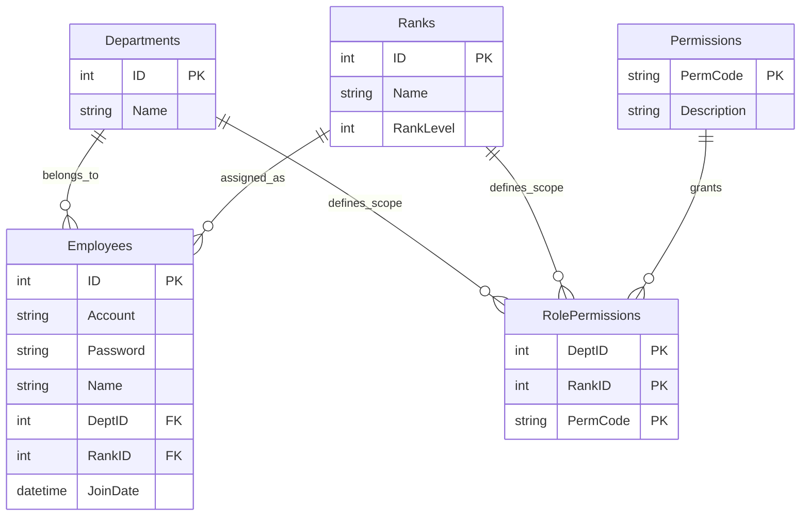

# HrmsDemo - 企業級 WinForms 權限管理系統範例

這是一個展示如何在傳統 **WinForms** 應用程式中，實現現代化架構、高效能數據處理與彈性權限設計 (RBAC) 的技術示範專案。適合開發者參考如何構建可維護的企業級桌面應用程式。

## 專案亮點 (Key Features)

### 1. 高效能數據呈現 (High Performance UI)
不依賴分頁控制項，直接實作 **DataGridView Virtual Mode (虛擬模式)**。
- **毫秒級載入**: 僅渲染視窗可見範圍內的數據，即使資料庫有數萬筆員工資料，介面依然流暢不卡頓。
- **動態捲動**: 模擬無限捲動 (Infinite Scroll) 的使用者體驗。

### 2. 精細的權限控制系統 (Flexible RBAC)
捨棄單純的「管理員/使用者」二分法，採用 **由下而上 (Bottom-up)** 的權限設計模式：
- **矩陣式角色**: 角色由 `部門 (Department)` + `職級 (Rank)` 交叉組合而成 (例如：人事部-經理、行政部-職員)。
- **資料範圍權限**: 支援細粒度的資料存取範圍控制：
  - `VIEW_SELF`: 僅查看自己
  - `VIEW_DEPT`: 僅查看同部門
  - `VIEW_ALL`: 查看全公司
- **功能級權限**: 針對特定按鈕或操作 (新增、修改、刪除) 進行授權。

### 3. 清晰的分層架構 (Clean Architecture)
展示如何在 WinForms 專案中維持程式碼的整潔與可測試性：
- **Repository Pattern**: 將資料存取邏輯封裝，與 UI 解耦。
- **Service Layer**: 集中處理商業邏輯與權限驗證。
- **Thin UI**: Form 只負責顯示與事件轉發，不包含複雜邏輯。

---

## 技術核心 (Tech Stack)

*   **Runtime**: .NET 10.0 (Windows) - 運用最新的 .NET 效能優勢。
*   **ORM**: [Dapper](https://github.com/DapperLib/Dapper) - 輕量級、高效能的微型 ORM，保留 SQL 的彈性與全速運作。
*   **Database**: MySQL 8.0+ - 穩定可靠的開源資料庫。
*   **Design Pattern**: Repository Pattern, Singleton (DbHelper), Async/Await。

---

## 快速展示 (Quick Demo)

本專案內建預設的測試情境，方便快速體驗不同角色的權限差異：

1. **超級管理者 (人事-主管)**: 登入 `hr_manager` / `1234`
   - *體驗*: 可以看到所有按鈕，能編輯任何人，能管理部門與職位。
2. **部門管理者 (行政-主管)**: 登入 `admin_manager` / `1234`
   - *體驗*: 只能看到自己部門的員工，且無法點擊「系統設定」相關按鈕。
3. **一般員工 (行政-職員)**: 登入 `admin_staff` / `1234`
   - *體驗*: 登入後列表只有自己一筆資料，無法進行任何編輯操作。

## 資料庫架構 (Database Schema)

## 初始 Prompt

# 人事管理系統 Demo 專案需求規格

## 🛠️ 開發環境與技術 (Environment)

- **工具**: Visual Studio 2026
- **框架**: .NET 10.0, WinForms
- **語言**: C#
- **資料庫**: MySQL (Ver 8.0)
- **專案名稱**: 人事管理系統 demo

## 📋 功能需求 (Functional Requirements)

1.  **員工資料管理**
    - 欄位: `ID`, `name`, `account`, `password`, `gender`, `rankID`, `deptID`, `birthday`, `createDate`, `joinDate`, `leaveDate`, `isEmployed`, `mobile`, `email`, `note`

2.  **部門資料管理**
    - 欄位: `ID`, `name`

3.  **職位資料管理**
    - 欄位: `ID`, `name`, `rankLevel`

4.  **權限資料管理**
    - 欄位: `permCode`, `description`

5.  **角色權限管理**
    - 規則: 角色由 **部門** 與 **職位** 排列組合而成。
    - 關聯: `deptID`, `rankID`, `permission`

6.  **登入機制**
    - 開啟應用程式後顯示登入畫面。
    - 登入成功進入主畫面。
    - 登出後返回登入畫面。
    - 登入畫面輸入框需保留上一個登入者的 `account`。

7.  **主畫面 - 左側列表 (員工概覽)**
    - 使用 `dataGridView1` 顯示。
    - 具有搜尋功能。
    - 點擊列表項目，右側顯示詳細資訊。
    - 進入主畫面時，根據登入者權限過濾可見員工列表。
    - 預設選取登入者資料並置頂。

8.  **主畫面 - 右側表單 (詳細資訊)**
    - **顯示欄位**:
        - `TextBox`: 帳號 (ReadOnly), 密碼, 姓名, 行動電話, 電子信箱, 備註
        - `ComboBox`: 性別, 職級, 部門 (資料庫載入)
        - `DateTimePicker`: 生日, 加入日期, 離職日期
        - `CheckBox`: 是否離職
    - **互動**: 點擊左側列表顯示對應資料 (預設顯示登入者)。
    - **功能按鈕**: 新增, 修改, 刪除, 取消。

9.  **主畫面 - 上方選單 (MenuStrip)**
    - `toolStripMenuItem1` 功能包含:
        - 開啟部門資料管理
        - 開啟職位資料管理
        - 開啟權限資料管理
        - 開啟角色權限管理
        - 登出

10. **權限代碼定義 (Permissions)**
    | 代碼 | 描述 |
    | :--- | :--- |
    | `ADD_USER` | 新增員工 |
    | `DELETE_USER` | 刪除員工 |
    | `EDIT_USER` | 修改員工 |
    | `SET_RESIGNED` | 設為離職 |
    | `VIEW_ALL` | 查看所有員工資料 |
    | `VIEW_SELF` | 只能查看自己的資料 |
    | `VIEW_DEPT` | 只能查看自己的部門員工資料 |
    | `WRITE_NOTE` | 修改與檢視員工備註 |
    | `ADD_DEPT` | 新增部門 |
    | `DELETE_DEPT` | 刪除部門 |
    | `EDIT_DEPT` | 修改部門 |
    | `ADD_RANK` | 新增職位 |
    | `DELETE_RANK` | 刪除職位 |
    | `EDIT_RANK` | 修改職位 |
    | `ADD_ROLE_PERM` | 新增角色權限 |
    | `DELETE_ROLE_PERM` | 刪除角色權限 |
    | `EDIT_ROLE_PERM` | 修改角色權限 |

11. **初始資料 - 部門**
    - 人事, 行政

12. **初始資料 - 職位**
    - 主管, 職員

13. **初始資料 - 角色權限設定**
    - **人事主管**:
        - `VIEW_ALL`, `EDIT_USER`, `SET_RESIGNED`, `WRITE_NOTE`
        - `ADD_DEPT`, `EDIT_DEPT`, `DELETE_DEPT`
        - `ADD_RANK`, `EDIT_RANK`, `DELETE_RANK`
        - `ADD_ROLE_PERM`, `EDIT_ROLE_PERM`, `DELETE_ROLE_PERM`
    - **人事職員**:
        - `VIEW_ALL`, `ADD_USER`, `EDIT_USER`, `WRITE_NOTE`
    - **行政主管**:
        - `VIEW_DEPT`, `WRITE_NOTE`
    - **行政職員**:
        - `VIEW_SELF`

14. **詳細操作流程**
    1.  **登入**:
        - 失敗/連線錯誤: 跳出 `MessageBox` 警告。
    2.  **主畫面載入**:
        - 左側列表: 最上方為登入者。
        - 右側詳細: 顯示登入者資料。
    3.  **新增員工**:
        - 點擊「新增」 (需 `ADD_USER` 權限)。
        - UI 變化: 新增Disable, 修改變「儲存」, 表單清空。
        - 點擊「儲存」: 寫入 DB (Transaction)。
        - 點擊「取消」: MessageBox 確認, 恢復 UI。
    4.  **修改員工**:
        - 點擊「修改」 (需 `EDIT_USER` 權限)。
        - UI 變化: 修改變「儲存」, 欄位可編輯。
        - 點擊「儲存」: 更新 DB (Transaction)。
        - 點擊「取消」: 若有變更則 MessageBox 確認。
    5.  **刪除員工**:
        - 點擊「刪除」 (需 `DELETE_USER` 權限)。
        - `MessageBox` 確認後執行 DELETE (Transaction)。
    6.  **設為離職**:
        - 編輯模式下，選擇離職日期 -> 自動勾選「已離職」 -> 儲存。
    7.  **搜尋功能**:
        - 輸入文字 -> 點擊搜尋 -> 過濾 Grid。
        - 選擇職級/部門 ComboBox -> 過濾 Grid。
    8.  **登出**:
        - 點擊選單「登出」 -> `MessageBox` 確認 -> 返回登入畫面。
