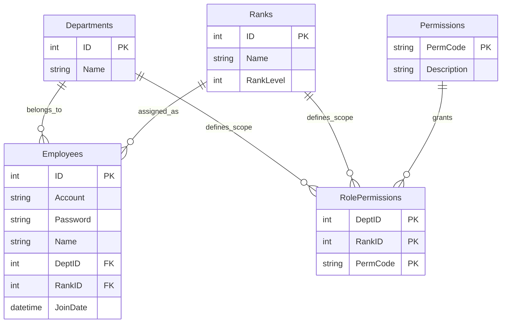

# HrmsDemo - 企業級 WinForms 權限管理系統範例

這是一個展示如何在傳統 **WinForms** 應用程式中，實現現代化架構、高效能數據處理與彈性權限設計 (RBAC) 的技術示範專案。適合開發者參考如何構建可維護的企業級桌面應用程式。

## 專案亮點 (Key Features)

### 1. 高效能數據呈現 (High Performance UI)
不依賴分頁控制項，直接實作 **DataGridView Virtual Mode (虛擬模式)**。
- **毫秒級載入**: 僅渲染視窗可見範圍內的數據，即使資料庫有數萬筆員工資料，介面依然流暢不卡頓。
- **動態捲動**: 模擬無限捲動 (Infinite Scroll) 的使用者體驗。

### 2. 精細的權限控制系統 (Flexible RBAC)
捨棄單純的「管理員/使用者」二分法，採用 **由下而上 (Bottom-up)** 的權限設計模式：
- **矩陣式角色**: 角色由 `部門 (Department)` + `職級 (Rank)` 交叉組合而成 (例如：人事部-經理、行政部-職員)。
- **資料範圍權限**: 支援細粒度的資料存取範圍控制：
  - `VIEW_SELF`: 僅查看自己
  - `VIEW_DEPT`: 僅查看同部門
  - `VIEW_ALL`: 查看全公司
- **功能級權限**: 針對特定按鈕或操作 (新增、修改、刪除) 進行授權。

### 3. 清晰的分層架構 (Clean Architecture)
展示如何在 WinForms 專案中維持程式碼的整潔與可測試性：
- **Repository Pattern**: 將資料存取邏輯封裝，與 UI 解耦。
- **Service Layer**: 集中處理商業邏輯與權限驗證。
- **Thin UI**: Form 只負責顯示與事件轉發，不包含複雜邏輯。

---

## 技術核心 (Tech Stack)

*   **Runtime**: .NET 10.0 (Windows) - 運用最新的 .NET 效能優勢。
*   **ORM**: [Dapper](https://github.com/DapperLib/Dapper) - 輕量級、高效能的微型 ORM，保留 SQL 的彈性與全速運作。
*   **Database**: MySQL 8.0+ - 穩定可靠的開源資料庫。
*   **Design Pattern**: Repository Pattern, Singleton (DbHelper), Async/Await。

---

## 快速展示 (Quick Demo)

本專案內建預設的測試情境，方便快速體驗不同角色的權限差異：

1. **超級管理者 (人事-主管)**: 登入 `hr_manager` / `1234`
   - *體驗*: 可以看到所有按鈕，能編輯任何人，能管理部門與職位。
2. **部門管理者 (行政-主管)**: 登入 `admin_manager` / `1234`
   - *體驗*: 只能看到自己部門的員工，且無法點擊「系統設定」相關按鈕。
3. **一般員工 (行政-職員)**: 登入 `admin_staff` / `1234`
   - *體驗*: 登入後列表只有自己一筆資料，無法進行任何編輯操作。

## 資料庫架構 (Database Schema)

